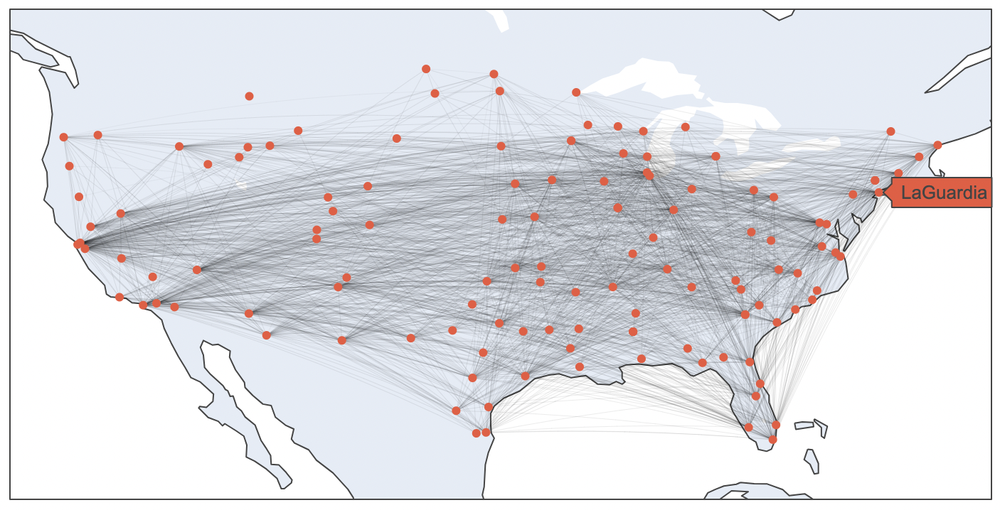
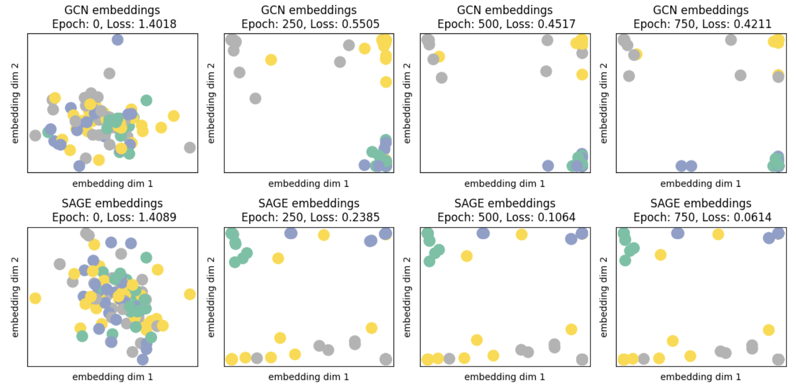

# GNN Starter Code

This repo loads a dataset of airports as a simple demonstration of how graph neural networks can encode useful information to model data that naturally has a network shape:

We show how to visualize the embeddings of the final layer to compare how effectively models are separating the data according to the classification task at hand

## Download

Download this project from your command line by running

`git clone https://github.com/mcembalest/GNN.git`

## Enrivonment

Create a new conda environment with python version 3.10:

`conda create --name gnn-demo python=3.10`

You can now setup the environment for this project by running the included shell script:

1. Activate the new environment:

    `conda activate gnn-demo`

2. Install libraries into the new environment:

    `zsh setup_environment.zsh`

3. If step 2 worked, ignore step 3. If step 2 did not work, you can run the two lines that are in `setup_environment.zsh` directly:

    `pip install -r requirements.txt`

    `pip install torch-scatter torch-sparse torch-cluster torch-spline-conv torch-geometric -f https://data.pyg.org/whl/torch-1.12.0+cpu.html`

## Airports Example

Run the notebook `airports.ipynb` to load a Pytorch-Geomtetric graph dataset of US airports. 

Each node is an airport, and each edge indicates the existence of a flight between the airports.

Each node is given a label indicating which quartile of passenger activity the airport has (label==0 means top 25% of passenger activity, label==3 means bottom 25% of passenger activity).

This notebook compares two methods of predicting the activity label of each airport: a baseline logistic regression model vs graph neural networks.
