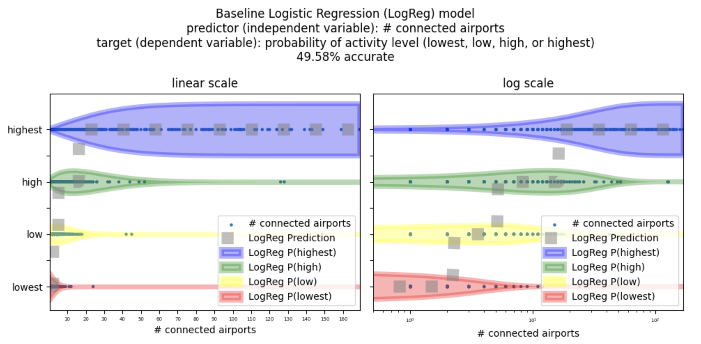
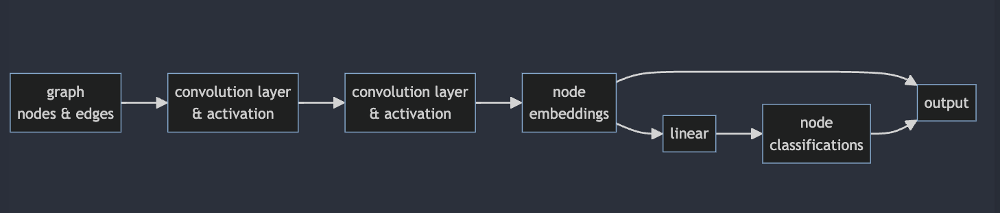

# Graph Neural Network (GNN) Starter Code

Run notebook `airports.ipynb` to view an example graph dataset and train GNNs to model the data (comparing against a baseline logistic regression model)

## Airports Data

Graphs like the map of US airports encode which nodes (airports) are connected to which other nodes via edges (available flights)


The goal for this dataset is to be able to predict how busy and active each airport is, as measured by # of passengers passing through the airport each year (This is therefore a *node classification* task, as opposed to other types of graph modeling tasks like edge classificaiton or full-graph classification). 

The only data available as a predictor is the graph of airport connectivity - that is, a matrix of 0s and 1s with a 1 indicating there is an available flight between airports. 

Each airport is given the label 0, 1, 2, or 3, representing its activity level (label 0 is highest activity, label 3 is lowest activity).

To evaluate against a baseline model, we train a logistic regression classifier to predict the label for each node using each node's # of neighbors as the only feature (the # of neighbors of an airport is the number of airports one direct flight away). We can only get around 50% accuracy with this baseline since there are plenty of airports that deviate from the general trend of more connected airports, more passengers.



## GNN

We use graph convolutions to encode nodes into 2d embedding vectors, which are then used to classify each node.

Our models output the node embeddings in addition to the node classifications which we use for visualization.

We test two different convolution types available as PyTorch Geometric modules: `GCNConv` and `GraphSAGE`. We have found that `GraphSAGE` is able to beat the baseline whereas `GCNConv` is not yet observed to have done so. Additionally, we believe there are qualitative differences in the learning trajectories visualized below that seem to suggest `GraphSAGE` is a more efficient learner of this data than `GCNConv`.



## Visualize Learning Trajectory

We show how to visualize the trajectory of the output embeddings during training to qualitatively evaluate how the models learn to classify the data (this type of visualization/representation is not specific to GNNs.)


A trajectory plot like this can be useful to visualize how the model learned to "factor" the data for the classification task at hand, helping us answer the following questions: 

### Did the model learn to spatially arrange the classes for easy separability? 

For this class-balanced four-way classification dataset, this looks like separating the four colors cleanly into the four corners of the 2d output embedding space. (By the way, a visually intuitive takeaway from this kind of plot is that the natural representation dimension should scale logarithmically as the number of classification dimensions increases)

### In what order did the model learn to factor the data during training? 

We sometimes observe by looking at this trajectory plot that the model first factors the data into two sets, and then subsequently learns to split each of the two sets again into two, in order to arrive at the four classes of the classification problem (e.g. it first learned to separate the data into {lowest & low}, {highest & high} before learning how to separate the data into {lowest}, {low}, {high}, and {highest})

This ordering can give us more or less confidence in the learned representations - we can investigate if the observed data factoring is natural or spurious.

This way of thinking about the trajectory of feature learning dynamics was inspired by the [Toy Models of Superposition paper by Anthropic](https://transformer-circuits.pub/2022/toy_model/index.html#learning)

## Setup

Download this project from your command line by running

```bash
git clone https://github.com/mcembalest/GNN.git
```

Create a new conda environment with python version 3.10:

```bash
conda create -n gnn_env python=3.10
```

You can now setup the environment for this project:

```bash
conda activate gnn_env
pip install -r requirements.txt
pip install torch-scatter torch-sparse torch-cluster torch-spline-conv torch-geometric -f https://data.pyg.org/whl/torch-1.12.0+cpu.html
```

